# brms baseline model
Simon Frost

## Libraries

``` r
library(brms)
```

    Loading required package: Rcpp

    Loading 'brms' package (version 2.22.0). Useful instructions
    can be found by typing help('brms'). A more detailed introduction
    to the package is available through vignette('brms_overview').


    Attaching package: 'brms'

    The following object is masked from 'package:stats':

        ar

``` r
library(ggplot2)
```

``` r
set.seed(123)  # for reproducibility
```

## Helper functions

``` r
read_inla_to_mgcv <- function(file) {
  # Read all lines
  lines <- readLines(file)
  
  # First line is number of regions
  n <- as.integer(lines[1])
  
  # Initialize empty list
  nb_list <- vector("list", n)
  
  # Loop over each region
  for (i in 1:n) {
    parts <- strsplit(lines[i + 1], "\\s+")[[1]]
    parts <- parts[parts != ""]  # remove empties
    
    # Format: region_id, num_neighbors, neighbors...
    region_id <- as.integer(parts[1])
    #nbs <- as.integer(parts[-c(1, 2)])
    nbs <- parts[-c(1,2)]
    nb_list[[region_id]] <- nbs
  }
  
  nb_list
}
```

``` r
subset_nb <- function(nb_list, keep) {
  # ensure 'keep' is integer indices
  keep_int <- as.integer(keep)
  keep_char <- as.character(keep)
  # subset to regions in keep
  nb_sub <- nb_list[keep_int]
  
  # drop neighbors not in keep
  nb_sub <- lapply(nb_sub, function(nbs) nbs[nbs %in% keep_char])
  
  # keep original indices as names
  names(nb_sub) <- keep
  
  nb_sub
}
```

## Load data and process

``` r
df <- read.table("../data/lassa_states_endemic.tsv", header=TRUE, row.names=NULL)
# Exclude missing (forecast) datapoints
df <- df[!is.na(df$y),]
# Enforce factors
df$region <- as.factor(df$region)
df$region2 <- as.factor(df$region2)
df$polyid2 <- as.factor(df$polyid2)
# Load neighbour file
nb_loc <- "../data/states_nbmatrix"
nb <- read_inla_to_mgcv(nb_loc)
nb2 <- subset_nb(nb, levels(df$polyid2))
```

``` r
# 1) Collect all area labels that appear either as a node or neighbor
L <- nb2
areas <- sort(unique(c(names(L), unlist(L, use.names = FALSE))))
n <- length(areas)

# 2) Map from label -> row/col index
lab2idx <- setNames(seq_len(n), areas)

# 3) Build a 0/1 adjacency (directed so far)
M <- matrix(0L, n, n, dimnames = list(areas, areas))
for (i_name in names(L)) {
  if (length(L[[i_name]]) == 0L) next
  i <- lab2idx[[i_name]]
  js <- lab2idx[L[[i_name]]]
  js <- js[!is.na(js)]             # just in case
  if (length(js)) M[i, js] <- 1L
}

# 4) Make it undirected/symmetric and remove self-loops
M <- 1L * ((M + t(M)) > 0)
diag(M) <- 0L

# (Optional) If your modeling factor is df$polyid, align the order:
if (is.factor(df$polyid)) {
  want <- levels(df$polyid)
  stopifnot(all(want %in% rownames(M)))
  M <- M[want, want, drop = FALSE]
}
```

## Fit model

Define formula, using single `spi` and `precip` variables.

``` r
form <- y ~ 1 +
    offset(logpop) +
    # Spatial ICAR/CAR effect (replacement for mgcv s(polyid, bs="mrf", xt=list(nb=...))):
    car(M = M, gr = polyid, type="icar") +
    # RW1 P-spline on year, one curve per polyid2:
    s(year, bs = "ps", m = 1, by = polyid2) +
    # cyclic spline on epiWeek (≈ RW2 over a cycle), per region2:
    s(epiWeek, bs = "cc", m = 2, by = region2) +
    # P-spline (RW2-like) covariates:
    s(spi,     bs = "ps", k = 12) +
    s(precip,  bs = "ps", k = 12)
```

``` r
fit <- brm(
  formula = bf(form),
  data    = df,
  data2 = list(M=M),
  family  = negbinomial(link = "log"),  # ≈ mgcv::nb()
  # cyclic splines need the period endpoints via the `knots` argument:
  knots   = list(epiWeek = c(min(df$epiWeek), max(df$epiWeek))),
  cores   = 4, chains = 4, iter = 3000, backend = "cmdstanr"
)
```

    Start sampling

    Running MCMC with 4 parallel chains...

    Chain 1 Iteration:    1 / 3000 [  0%]  (Warmup) 
    Chain 2 Iteration:    1 / 3000 [  0%]  (Warmup) 
    Chain 3 Iteration:    1 / 3000 [  0%]  (Warmup) 
    Chain 4 Iteration:    1 / 3000 [  0%]  (Warmup) 
    Chain 3 Iteration:  100 / 3000 [  3%]  (Warmup) 
    Chain 2 Iteration:  100 / 3000 [  3%]  (Warmup) 
    Chain 4 Iteration:  100 / 3000 [  3%]  (Warmup) 
    Chain 1 Iteration:  100 / 3000 [  3%]  (Warmup) 
    Chain 1 Iteration:  200 / 3000 [  6%]  (Warmup) 
    Chain 4 Iteration:  200 / 3000 [  6%]  (Warmup) 
    Chain 2 Iteration:  200 / 3000 [  6%]  (Warmup) 
    Chain 3 Iteration:  200 / 3000 [  6%]  (Warmup) 
    Chain 1 Iteration:  300 / 3000 [ 10%]  (Warmup) 
    Chain 4 Iteration:  300 / 3000 [ 10%]  (Warmup) 
    Chain 2 Iteration:  300 / 3000 [ 10%]  (Warmup) 
    Chain 3 Iteration:  300 / 3000 [ 10%]  (Warmup) 
    Chain 1 Iteration:  400 / 3000 [ 13%]  (Warmup) 
    Chain 2 Iteration:  400 / 3000 [ 13%]  (Warmup) 
    Chain 4 Iteration:  400 / 3000 [ 13%]  (Warmup) 
    Chain 3 Iteration:  400 / 3000 [ 13%]  (Warmup) 
    Chain 1 Iteration:  500 / 3000 [ 16%]  (Warmup) 
    Chain 2 Iteration:  500 / 3000 [ 16%]  (Warmup) 
    Chain 4 Iteration:  500 / 3000 [ 16%]  (Warmup) 
    Chain 3 Iteration:  500 / 3000 [ 16%]  (Warmup) 
    Chain 1 Iteration:  600 / 3000 [ 20%]  (Warmup) 
    Chain 2 Iteration:  600 / 3000 [ 20%]  (Warmup) 
    Chain 3 Iteration:  600 / 3000 [ 20%]  (Warmup) 
    Chain 4 Iteration:  600 / 3000 [ 20%]  (Warmup) 
    Chain 1 Iteration:  700 / 3000 [ 23%]  (Warmup) 
    Chain 2 Iteration:  700 / 3000 [ 23%]  (Warmup) 
    Chain 3 Iteration:  700 / 3000 [ 23%]  (Warmup) 
    Chain 4 Iteration:  700 / 3000 [ 23%]  (Warmup) 
    Chain 1 Iteration:  800 / 3000 [ 26%]  (Warmup) 
    Chain 2 Iteration:  800 / 3000 [ 26%]  (Warmup) 
    Chain 3 Iteration:  800 / 3000 [ 26%]  (Warmup) 
    Chain 4 Iteration:  800 / 3000 [ 26%]  (Warmup) 
    Chain 1 Iteration:  900 / 3000 [ 30%]  (Warmup) 
    Chain 2 Iteration:  900 / 3000 [ 30%]  (Warmup) 
    Chain 3 Iteration:  900 / 3000 [ 30%]  (Warmup) 
    Chain 1 Iteration: 1000 / 3000 [ 33%]  (Warmup) 
    Chain 4 Iteration:  900 / 3000 [ 30%]  (Warmup) 
    Chain 2 Iteration: 1000 / 3000 [ 33%]  (Warmup) 
    Chain 1 Iteration: 1100 / 3000 [ 36%]  (Warmup) 
    Chain 3 Iteration: 1000 / 3000 [ 33%]  (Warmup) 
    Chain 2 Iteration: 1100 / 3000 [ 36%]  (Warmup) 
    Chain 4 Iteration: 1000 / 3000 [ 33%]  (Warmup) 
    Chain 1 Iteration: 1200 / 3000 [ 40%]  (Warmup) 
    Chain 3 Iteration: 1100 / 3000 [ 36%]  (Warmup) 
    Chain 2 Iteration: 1200 / 3000 [ 40%]  (Warmup) 
    Chain 4 Iteration: 1100 / 3000 [ 36%]  (Warmup) 
    Chain 1 Iteration: 1300 / 3000 [ 43%]  (Warmup) 
    Chain 3 Iteration: 1200 / 3000 [ 40%]  (Warmup) 
    Chain 2 Iteration: 1300 / 3000 [ 43%]  (Warmup) 
    Chain 1 Iteration: 1400 / 3000 [ 46%]  (Warmup) 
    Chain 4 Iteration: 1200 / 3000 [ 40%]  (Warmup) 
    Chain 3 Iteration: 1300 / 3000 [ 43%]  (Warmup) 
    Chain 2 Iteration: 1400 / 3000 [ 46%]  (Warmup) 
    Chain 1 Iteration: 1500 / 3000 [ 50%]  (Warmup) 
    Chain 1 Iteration: 1501 / 3000 [ 50%]  (Sampling) 
    Chain 4 Iteration: 1300 / 3000 [ 43%]  (Warmup) 
    Chain 3 Iteration: 1400 / 3000 [ 46%]  (Warmup) 
    Chain 2 Iteration: 1500 / 3000 [ 50%]  (Warmup) 
    Chain 2 Iteration: 1501 / 3000 [ 50%]  (Sampling) 
    Chain 1 Iteration: 1600 / 3000 [ 53%]  (Sampling) 
    Chain 3 Iteration: 1500 / 3000 [ 50%]  (Warmup) 
    Chain 3 Iteration: 1501 / 3000 [ 50%]  (Sampling) 
    Chain 4 Iteration: 1400 / 3000 [ 46%]  (Warmup) 
    Chain 2 Iteration: 1600 / 3000 [ 53%]  (Sampling) 
    Chain 1 Iteration: 1700 / 3000 [ 56%]  (Sampling) 
    Chain 3 Iteration: 1600 / 3000 [ 53%]  (Sampling) 
    Chain 4 Iteration: 1500 / 3000 [ 50%]  (Warmup) 
    Chain 4 Iteration: 1501 / 3000 [ 50%]  (Sampling) 
    Chain 2 Iteration: 1700 / 3000 [ 56%]  (Sampling) 
    Chain 1 Iteration: 1800 / 3000 [ 60%]  (Sampling) 
    Chain 4 Iteration: 1600 / 3000 [ 53%]  (Sampling) 
    Chain 3 Iteration: 1700 / 3000 [ 56%]  (Sampling) 
    Chain 2 Iteration: 1800 / 3000 [ 60%]  (Sampling) 
    Chain 1 Iteration: 1900 / 3000 [ 63%]  (Sampling) 
    Chain 4 Iteration: 1700 / 3000 [ 56%]  (Sampling) 
    Chain 3 Iteration: 1800 / 3000 [ 60%]  (Sampling) 
    Chain 2 Iteration: 1900 / 3000 [ 63%]  (Sampling) 
    Chain 1 Iteration: 2000 / 3000 [ 66%]  (Sampling) 
    Chain 3 Iteration: 1900 / 3000 [ 63%]  (Sampling) 
    Chain 4 Iteration: 1800 / 3000 [ 60%]  (Sampling) 
    Chain 2 Iteration: 2000 / 3000 [ 66%]  (Sampling) 
    Chain 1 Iteration: 2100 / 3000 [ 70%]  (Sampling) 
    Chain 3 Iteration: 2000 / 3000 [ 66%]  (Sampling) 
    Chain 4 Iteration: 1900 / 3000 [ 63%]  (Sampling) 
    Chain 2 Iteration: 2100 / 3000 [ 70%]  (Sampling) 
    Chain 1 Iteration: 2200 / 3000 [ 73%]  (Sampling) 
    Chain 4 Iteration: 2000 / 3000 [ 66%]  (Sampling) 
    Chain 3 Iteration: 2100 / 3000 [ 70%]  (Sampling) 
    Chain 2 Iteration: 2200 / 3000 [ 73%]  (Sampling) 
    Chain 1 Iteration: 2300 / 3000 [ 76%]  (Sampling) 
    Chain 4 Iteration: 2100 / 3000 [ 70%]  (Sampling) 
    Chain 3 Iteration: 2200 / 3000 [ 73%]  (Sampling) 
    Chain 2 Iteration: 2300 / 3000 [ 76%]  (Sampling) 
    Chain 1 Iteration: 2400 / 3000 [ 80%]  (Sampling) 
    Chain 4 Iteration: 2200 / 3000 [ 73%]  (Sampling) 
    Chain 3 Iteration: 2300 / 3000 [ 76%]  (Sampling) 
    Chain 2 Iteration: 2400 / 3000 [ 80%]  (Sampling) 
    Chain 1 Iteration: 2500 / 3000 [ 83%]  (Sampling) 
    Chain 4 Iteration: 2300 / 3000 [ 76%]  (Sampling) 
    Chain 3 Iteration: 2400 / 3000 [ 80%]  (Sampling) 
    Chain 2 Iteration: 2500 / 3000 [ 83%]  (Sampling) 
    Chain 1 Iteration: 2600 / 3000 [ 86%]  (Sampling) 
    Chain 4 Iteration: 2400 / 3000 [ 80%]  (Sampling) 
    Chain 3 Iteration: 2500 / 3000 [ 83%]  (Sampling) 
    Chain 2 Iteration: 2600 / 3000 [ 86%]  (Sampling) 
    Chain 1 Iteration: 2700 / 3000 [ 90%]  (Sampling) 
    Chain 3 Iteration: 2600 / 3000 [ 86%]  (Sampling) 
    Chain 4 Iteration: 2500 / 3000 [ 83%]  (Sampling) 
    Chain 2 Iteration: 2700 / 3000 [ 90%]  (Sampling) 
    Chain 1 Iteration: 2800 / 3000 [ 93%]  (Sampling) 
    Chain 3 Iteration: 2700 / 3000 [ 90%]  (Sampling) 
    Chain 4 Iteration: 2600 / 3000 [ 86%]  (Sampling) 
    Chain 2 Iteration: 2800 / 3000 [ 93%]  (Sampling) 
    Chain 1 Iteration: 2900 / 3000 [ 96%]  (Sampling) 
    Chain 3 Iteration: 2800 / 3000 [ 93%]  (Sampling) 
    Chain 4 Iteration: 2700 / 3000 [ 90%]  (Sampling) 
    Chain 2 Iteration: 2900 / 3000 [ 96%]  (Sampling) 
    Chain 1 Iteration: 3000 / 3000 [100%]  (Sampling) 
    Chain 1 finished in 2523.4 seconds.
    Chain 3 Iteration: 2900 / 3000 [ 96%]  (Sampling) 
    Chain 4 Iteration: 2800 / 3000 [ 93%]  (Sampling) 
    Chain 2 Iteration: 3000 / 3000 [100%]  (Sampling) 
    Chain 2 finished in 2570.6 seconds.
    Chain 3 Iteration: 3000 / 3000 [100%]  (Sampling) 
    Chain 3 finished in 2638.7 seconds.
    Chain 4 Iteration: 2900 / 3000 [ 96%]  (Sampling) 
    Chain 4 Iteration: 3000 / 3000 [100%]  (Sampling) 
    Chain 4 finished in 2733.8 seconds.

    All 4 chains finished successfully.
    Mean chain execution time: 2616.7 seconds.
    Total execution time: 2733.9 seconds.

    Warning: 5996 of 6000 (100.0%) transitions hit the maximum treedepth limit of 10.
    See https://mc-stan.org/misc/warnings for details.

    Loading required namespace: rstan

## Model summary

``` r
summary(fit)
```

     Family: negbinomial 
      Links: mu = log; shape = identity 
    Formula: y ~ 1 + offset(logpop) + car(M = M, gr = polyid, type = "icar") + s(year, bs = "ps", m = 1, by = polyid2) + s(epiWeek, bs = "cc", m = 2, by = region2) + s(spi, bs = "ps", k = 12) + s(precip, bs = "ps", k = 12) 
       Data: df (Number of observations: 4732) 
      Draws: 4 chains, each with iter = 3000; warmup = 1500; thin = 1;
             total post-warmup draws = 6000

    Smoothing Spline Hyperparameters:
                            Estimate Est.Error l-95% CI u-95% CI Rhat Bulk_ESS
    sds(syearpolyid25_1)        0.66      0.23     0.35     1.23 1.00     1979
    sds(syearpolyid211_1)       1.14      0.43     0.50     2.16 1.01     1202
    sds(syearpolyid212_1)       0.81      0.24     0.47     1.40 1.00     1359
    sds(syearpolyid229_1)       1.15      0.41     0.56     2.13 1.00     1252
    sds(syearpolyid232_1)       0.90      0.39     0.36     1.84 1.00     1197
    sds(syearpolyid235_1)       1.46      0.57     0.66     2.86 1.00     1259
    sds(sepiWeekregion21_1)     0.38      0.13     0.21     0.71 1.01     1267
    sds(sepiWeekregion22_1)     0.32      0.11     0.19     0.60 1.00     1165
    sds(sspi_1)                 0.08      0.05     0.02     0.21 1.00     2514
    sds(sprecip_1)              0.11      0.06     0.04     0.27 1.00     1679
                            Tail_ESS
    sds(syearpolyid25_1)        3018
    sds(syearpolyid211_1)       1815
    sds(syearpolyid212_1)       2607
    sds(syearpolyid229_1)       1878
    sds(syearpolyid232_1)       1914
    sds(syearpolyid235_1)       2463
    sds(sepiWeekregion21_1)     2045
    sds(sepiWeekregion22_1)     2073
    sds(sspi_1)                 3121
    sds(sprecip_1)              2379

    Correlation Structures:
          Estimate Est.Error l-95% CI u-95% CI Rhat Bulk_ESS Tail_ESS
    sdcar     0.70      0.31     0.33     1.48 1.01     1284     1450

    Regression Coefficients:
              Estimate Est.Error l-95% CI u-95% CI Rhat Bulk_ESS Tail_ESS
    Intercept    -4.72      0.05    -4.81    -4.63 1.00     3621     4175
    sspi_1       -0.05      0.09    -0.23     0.13 1.00     3837     3857
    sprecip_1     0.06      0.05    -0.03     0.16 1.00     3026     2875

    Further Distributional Parameters:
          Estimate Est.Error l-95% CI u-95% CI Rhat Bulk_ESS Tail_ESS
    shape     1.96      0.12     1.73     2.23 1.00     8530     4461

    Draws were sampled using sample(hmc). For each parameter, Bulk_ESS
    and Tail_ESS are effective sample size measures, and Rhat is the potential
    scale reduction factor on split chains (at convergence, Rhat = 1).

## Model diagnostics

``` r
plot(fit)
```

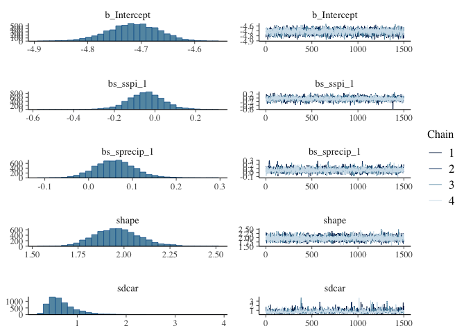

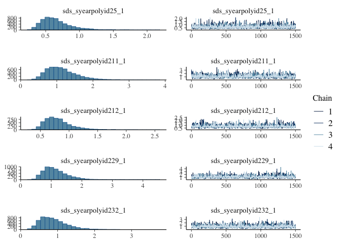

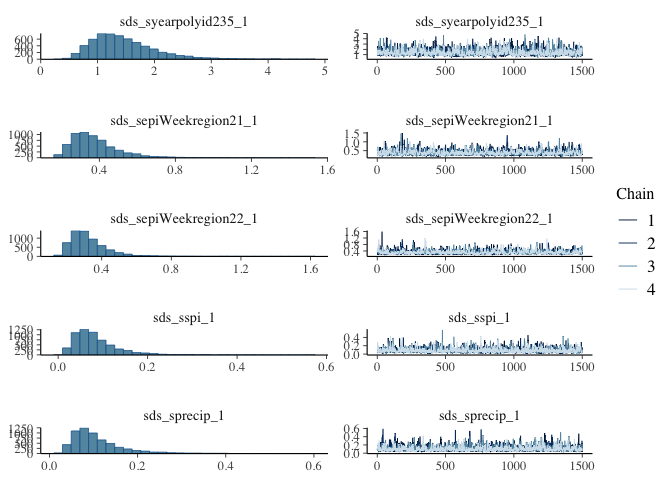

``` r
plot(conditional_effects(fit), points = TRUE)
```

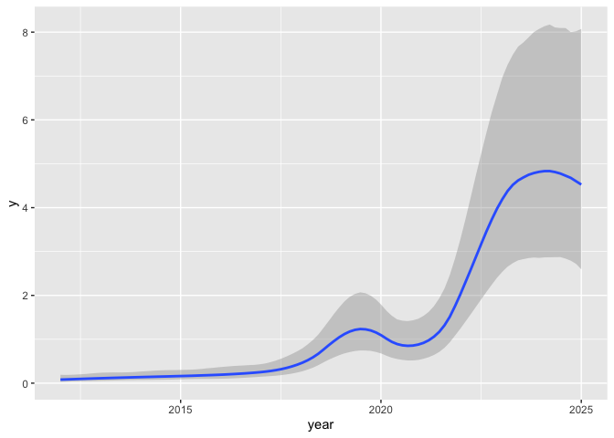

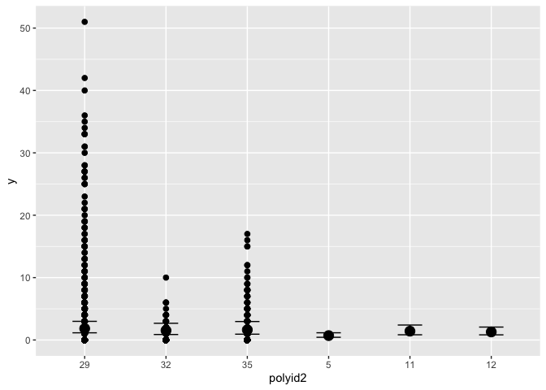

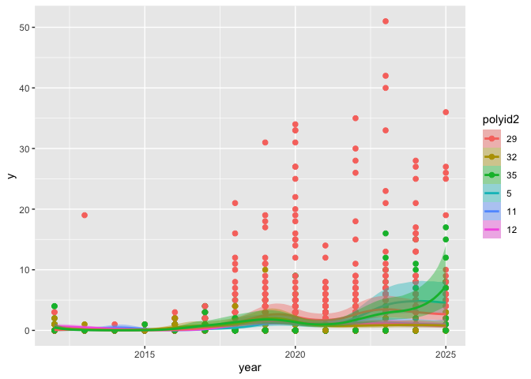

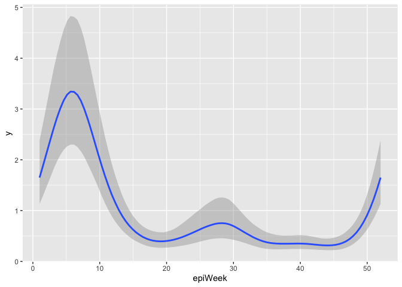

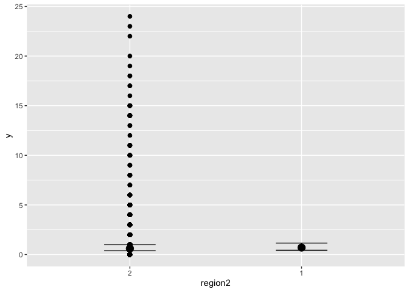

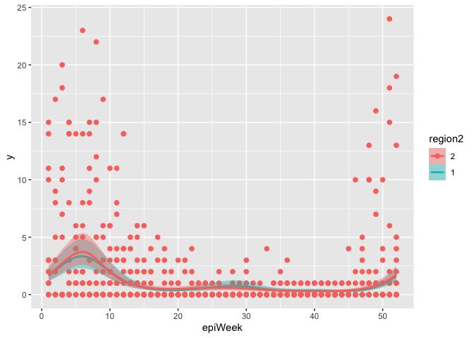

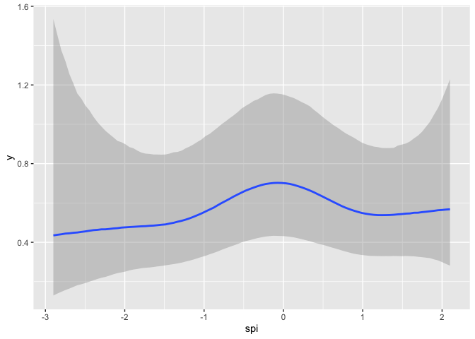

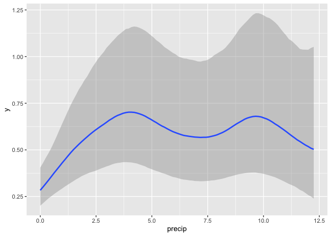

``` r
pp_check(fit)
```

    Using 10 posterior draws for ppc type 'dens_overlay' by default.

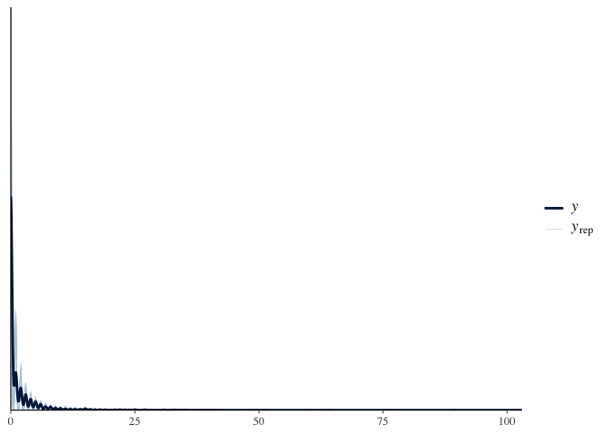

``` r
loo(fit)
```

    Warning: Found 2 observations with a pareto_k > 0.7 in model 'fit'. We
    recommend to set 'moment_match = TRUE' in order to perform moment matching for
    problematic observations.


    Computed from 6000 by 4732 log-likelihood matrix.

             Estimate    SE
    elpd_loo  -5378.3 102.1
    p_loo       110.2  20.3
    looic     10756.6 204.1
    ------
    MCSE of elpd_loo is NA.
    MCSE and ESS estimates assume MCMC draws (r_eff in [0.3, 1.7]).

    Pareto k diagnostic values:
                             Count Pct.    Min. ESS
    (-Inf, 0.7]   (good)     4730  100.0%  261     
       (0.7, 1]   (bad)         1    0.0%  <NA>    
       (1, Inf)   (very bad)    1    0.0%  <NA>    
    See help('pareto-k-diagnostic') for details.
