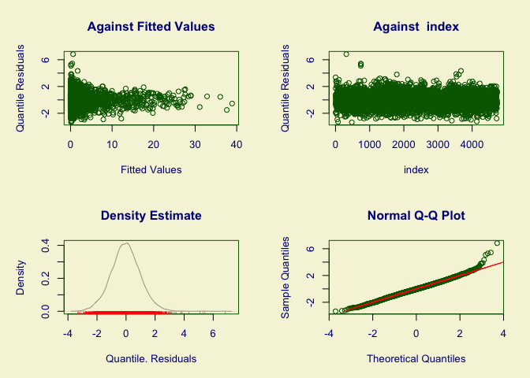

# gamlss baseline model
Simon Frost

## Libraries

``` r
library(gamlss)
```

    Loading required package: splines

    Loading required package: gamlss.data


    Attaching package: 'gamlss.data'

    The following object is masked from 'package:datasets':

        sleep

    Loading required package: gamlss.dist

    Loading required package: nlme

    Loading required package: parallel

     **********   GAMLSS Version 5.4-22  ********** 

    For more on GAMLSS look at https://www.gamlss.com/

    Type gamlssNews() to see new features/changes/bug fixes.

``` r
library(gamlss.dist)
library(gamlss.add)
```

    Loading required package: mgcv

    This is mgcv 1.9-3. For overview type 'help("mgcv-package")'.


    Attaching package: 'mgcv'

    The following object is masked from 'package:gamlss':

        lp

    Loading required package: nnet


    Attaching package: 'nnet'

    The following object is masked from 'package:mgcv':

        multinom

    Loading required package: rpart

``` r
library(gamlss.spatial)
```

    Loading required package: spam

    Spam version 2.11-1 (2025-01-20) is loaded.
    Type 'help( Spam)' or 'demo( spam)' for a short introduction 
    and overview of this package.
    Help for individual functions is also obtained by adding the
    suffix '.spam' to the function name, e.g. 'help( chol.spam)'.


    Attaching package: 'spam'

    The following objects are masked from 'package:base':

        backsolve, forwardsolve

    Warning: replacing previous import 'gamlss::lp' by 'mgcv::lp' when loading
    'gamlss.spatial'

``` r
library(ggplot2)
```

``` r
source("../utils/gamlss_coverage.R")
```

``` r
set.seed(123)  # for reproducibility
```

## Helper functions

``` r
read_inla_to_mgcv <- function(file) {
  # Read all lines
  lines <- readLines(file)
  
  # First line is number of regions
  n <- as.integer(lines[1])
  
  # Initialize empty list
  nb_list <- vector("list", n)
  
  # Loop over each region
  for (i in 1:n) {
    parts <- strsplit(lines[i + 1], "\\s+")[[1]]
    parts <- parts[parts != ""]  # remove empties
    
    # Format: region_id, num_neighbors, neighbors...
    region_id <- as.integer(parts[1])
    #nbs <- as.integer(parts[-c(1, 2)])
    nbs <- parts[-c(1,2)]
    nb_list[[region_id]] <- nbs
  }
  
  nb_list
}
```

``` r
subset_nb <- function(nb_list, keep) {
  # ensure 'keep' is integer indices
  keep_int <- as.integer(keep)
  keep_char <- as.character(keep)
  # subset to regions in keep
  nb_sub <- nb_list[keep_int]
  
  # drop neighbors not in keep
  nb_sub <- lapply(nb_sub, function(nbs) nbs[nbs %in% keep_char])
  
  # keep original indices as names
  names(nb_sub) <- keep
  
  nb_sub
}
```

## Load data and process

``` r
df <- read.table("../data/lassa_states_endemic.tsv", header=TRUE, row.names=NULL)
# Exclude missing (forecast) datapoints
df <- df[!is.na(df$y),]
# Enforce factors
df$region <- as.factor(df$region)
df$region2 <- as.factor(df$region2)
df$polyid <- as.factor(df$polyid)
df$polyid2 <- as.factor(df$polyid2)
# Load neighbour file
nb_loc <- "../data/states_nbmatrix"
nb <- read_inla_to_mgcv(nb_loc)
nb2 <- subset_nb(nb, levels(df$polyid2))
```

``` r
vars <- c("y","logpop","polyid","polyid2","region2","year","epiWeek","spi","precip")
df2 <- df[,vars]
```

## Fit model

Define formula, using single `spi` and `precip` variables.

``` r
form_ga <- formula(y ~ 1 +
                    offset(logpop) +
                    # Spatial effect – using a Markov random field smoother:
                    ga(~s(polyid, bs = "mrf", xt = list(nb = nb2))) +
                    # RW1 on year with one smooth per level of polyid2:
                    ga(~s(year, bs = "ps", m = 1, by = polyid2)) +
                    # RW2 on epiWeek, cyclic, with one smooth per level of region2:
                    ga(~s(epiWeek, bs = "cc", m = 2, by = region2)) +
                    # RW2 on spi:
                    ga(~s(spi, bs = "ps", m = 2)) +
                    # RW2 on precip:
                    ga(~s(precip, bs = "ps", m = 2)))
```

``` r
form_gamlss <- y ~ 1 +
  offset(logpop) +
  # Spatial MRF on areal IDs (use neighbour list or precision/polys)
  gmrf(polyid, neighbour = nb2, method = "Q") +
  # RW1-like smooth on year, one curve per level of polyid2
  pb(year, by = polyid2, control = pb.control(order = 1)) +
  # Cyclic RW2-like smooth on epiWeek, one curve per level of region2
  pbc(epiWeek, by = region2, control = pbc.control(order = 2)) +
  # RW2-like smooths for covariates
  pb(spi,    control = pb.control(order = 2)) +
  pb(precip, control = pb.control(order = 2))
```

``` r
fit <- gamlss(form_ga,
              family = NBI(),
              data = df2,
              control=gamlss.control(n.cyc=100))
```

    GAMLSS-RS iteration 1: Global Deviance = 10651.45 
    GAMLSS-RS iteration 2: Global Deviance = 10553.15 
    GAMLSS-RS iteration 3: Global Deviance = 10551.9 
    GAMLSS-RS iteration 4: Global Deviance = 10551.93 
    GAMLSS-RS iteration 5: Global Deviance = 10551.95 
    GAMLSS-RS iteration 6: Global Deviance = 10551.96 
    GAMLSS-RS iteration 7: Global Deviance = 10551.88 
    GAMLSS-RS iteration 8: Global Deviance = 10551.88 
    GAMLSS-RS iteration 9: Global Deviance = 10551.88 
    GAMLSS-RS iteration 10: Global Deviance = 10551.88 

## Model summary

``` r
summary(fit)
```

    ******************************************************************
    Family:  c("NBI", "Negative Binomial type I") 

    Call:  gamlss(formula = form_ga, family = NBI(), data = df2,  
        control = gamlss.control(n.cyc = 100)) 

    Fitting method: RS() 

    ------------------------------------------------------------------
    Mu link function:  log
    Mu Coefficients:
                Estimate Std. Error t value Pr(>|t|)    
    (Intercept)  -4.4628     0.0196  -227.7   <2e-16 ***
    ---
    Signif. codes:  0 '***' 0.001 '**' 0.01 '*' 0.05 '.' 0.1 ' ' 1

    ------------------------------------------------------------------
    Sigma link function:  log
    Sigma Coefficients:
                Estimate Std. Error t value Pr(>|t|)    
    (Intercept) -0.73615    0.06357  -11.58   <2e-16 ***
    ---
    Signif. codes:  0 '***' 0.001 '**' 0.01 '*' 0.05 '.' 0.1 ' ' 1

    ------------------------------------------------------------------
    NOTE: Additive smoothing terms exist in the formulas: 
     i) Std. Error for smoothers are for the linear effect only. 
    ii) Std. Error for the linear terms maybe are not accurate. 
    ------------------------------------------------------------------
    No. of observations in the fit:  4732 
    Degrees of Freedom for the fit:  77.50395
          Residual Deg. of Freedom:  4654.496 
                          at cycle:  10 
     
    Global Deviance:     10551.88 
                AIC:     10706.88 
                SBC:     11207.72 
    ******************************************************************

``` r
AIC(fit)
```

    [1] 10706.88

## Model diagnostics

``` r
plot(fit)
```



    ******************************************************************
         Summary of the Randomised Quantile Residuals
                               mean   =  -0.0231266 
                           variance   =  1.027963 
                   coef. of skewness  =  0.2194787 
                   coef. of kurtosis  =  4.005146 
    Filliben correlation coefficient  =  0.996728 
    ******************************************************************

``` r
coverage <- gamlss_predictive_coverage(
    fit,
    df2$y,
    level = 0.95,
    method = "parametric",
    nsim = 4000,
    use_shortest = TRUE,
    data_fit = df2
) 
```

``` r
coverage$coverage
```

    [1] 0.9706255
