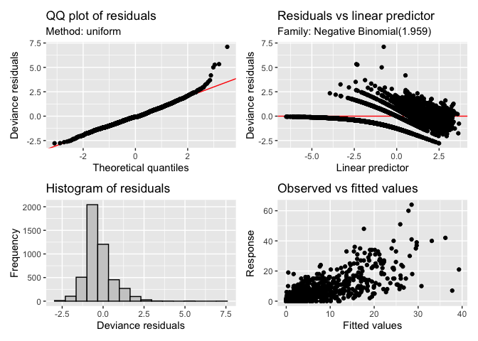

# mgcv baseline model
Simon Frost

## Libraries

``` r
library(mgcv)
```

    Loading required package: nlme

    This is mgcv 1.9-3. For overview type 'help("mgcv-package")'.

``` r
library(gratia)
library(ggplot2)
```

``` r
source("../utils/mgcv_coverage.R")
```

``` r
set.seed(123)  # for reproducibility
```

## Helper functions

``` r
read_inla_to_mgcv <- function(file) {
  # Read all lines
  lines <- readLines(file)
  
  # First line is number of regions
  n <- as.integer(lines[1])
  
  # Initialize empty list
  nb_list <- vector("list", n)
  
  # Loop over each region
  for (i in 1:n) {
    parts <- strsplit(lines[i + 1], "\\s+")[[1]]
    parts <- parts[parts != ""]  # remove empties
    
    # Format: region_id, num_neighbors, neighbors...
    region_id <- as.integer(parts[1])
    #nbs <- as.integer(parts[-c(1, 2)])
    nbs <- parts[-c(1,2)]
    nb_list[[region_id]] <- nbs
  }
  
  nb_list
}
```

``` r
subset_nb <- function(nb_list, keep) {
  # ensure 'keep' is integer indices
  keep_int <- as.integer(keep)
  keep_char <- as.character(keep)
  # subset to regions in keep
  nb_sub <- nb_list[keep_int]
  
  # drop neighbors not in keep
  nb_sub <- lapply(nb_sub, function(nbs) nbs[nbs %in% keep_char])
  
  # keep original indices as names
  names(nb_sub) <- keep
  
  nb_sub
}
```

## Load data and process

``` r
df <- read.table("../data/lassa_states_endemic.tsv", header=TRUE, row.names=NULL)
# Exclude missing (forecast) datapoints
df <- df[!is.na(df$y),]
# Enforce factors
df$region <- as.factor(df$region)
df$region2 <- as.factor(df$region2)
df$polyid2 <- as.factor(df$polyid2)
# Load neighbour file
nb_loc <- "../data/states_nbmatrix"
nb <- read_inla_to_mgcv(nb_loc)
nb2 <- subset_nb(nb, levels(df$polyid2))
```

## Fit model

Define formula, using single `spi` and `precip` variables.

``` r
form <- formula(y ~ 1 +
                      offset(logpop) +
                      # Spatial effect – using a Markov random field smoother:
                      s(polyid2, bs = "mrf", xt = list(nb = nb2)) +
                      # RW1 on year with one smooth per level of polyid2:
                      s(year, bs = "ps", m = 1, by = polyid2) +
                      # RW2 on epiWeek, cyclic, with one smooth per level of region2:
                      s(epiWeek, bs = "cc", m = 2, by = region2) +
                      # RW2 on spi:
                      s(spi, bs = "ps", k=12) +
                      # RW2 on precip:
                      s(precip, bs = "ps", k=12))
```

``` r
fit <- gam(form, data=df, family=nb())
```

## Model summary

``` r
summary(fit)
```


    Family: Negative Binomial(1.959) 
    Link function: log 

    Formula:
    y ~ 1 + offset(logpop) + s(polyid2, bs = "mrf", xt = list(nb = nb2)) + 
        s(year, bs = "ps", m = 1, by = polyid2) + s(epiWeek, bs = "cc", 
        m = 2, by = region2) + s(spi, bs = "ps", k = 12) + s(precip, 
        bs = "ps", k = 12)

    Parametric coefficients:
                Estimate Std. Error z value Pr(>|z|)    
    (Intercept) -4.67490    0.03899  -119.9   <2e-16 ***
    ---
    Signif. codes:  0 '***' 0.001 '**' 0.01 '*' 0.05 '.' 0.1 ' ' 1

    Approximate significance of smooth terms:
                          edf Ref.df Chi.sq p-value    
    s(polyid2)          4.841  4.972 954.47 < 2e-16 ***
    s(year):polyid25    6.816  9.000 390.35 < 2e-16 ***
    s(year):polyid211   7.734  9.000  95.27 < 2e-16 ***
    s(year):polyid212   8.237  9.000 291.24 < 2e-16 ***
    s(year):polyid229   8.132  9.000 482.87 < 2e-16 ***
    s(year):polyid232   6.672  9.000  55.24 < 2e-16 ***
    s(year):polyid235   7.573  9.000 173.10 < 2e-16 ***
    s(epiWeek):region21 7.190  8.000 455.72 < 2e-16 ***
    s(epiWeek):region22 7.146  8.000 508.97 < 2e-16 ***
    s(spi)              3.904  4.740  21.58 0.00052 ***
    s(precip)           5.330  6.348  37.35 < 2e-16 ***
    ---
    Signif. codes:  0 '***' 0.001 '**' 0.01 '*' 0.05 '.' 0.1 ' ' 1

    R-sq.(adj) =  0.648   Deviance explained = 69.4%
    -REML =   5449  Scale est. = 1         n = 4732

``` r
AIC(fit)
```

    [1] 10726.51

## Model diagnostics

``` r
appraise(fit)
```



``` r
coverage <- gam_predictive_coverage(
    fit,
    level = 0.95,
    method = "parametric",
    nsim = 4000,
    use_shortest = TRUE,
    # parametric options:
    parametric_engine = "simulate",
    unconditional = TRUE   # include smoothing-parameter uncertainty (simulate + vcov)
) 
```

``` r
coverage$coverage
```

    [1] 0.9712595
