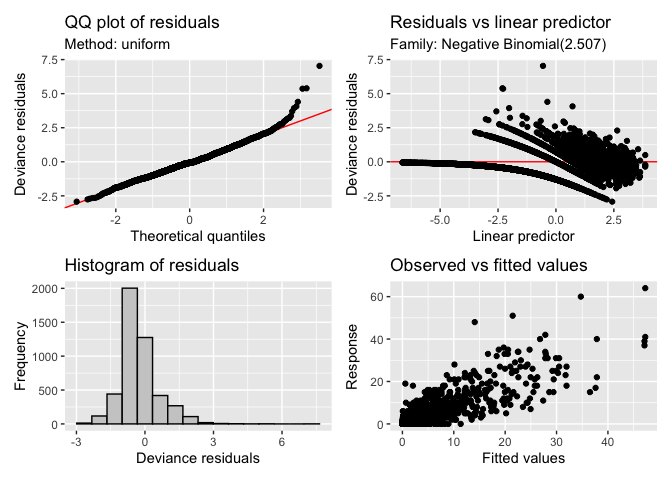

# mgcv DLNM
Simon Frost

## Libraries

``` r
library(mgcv)
```

    Loading required package: nlme

    This is mgcv 1.9-3. For overview type 'help("mgcv-package")'.

``` r
library(gratia)
library(ggplot2)
```

``` r
source("../utils/mgcv_coverage.R")
```

``` r
set.seed(123)  # for reproducibility
```

## Helper functions

``` r
read_inla_to_mgcv <- function(file) {
  # Read all lines
  lines <- readLines(file)
  
  # First line is number of regions
  n <- as.integer(lines[1])
  
  # Initialize empty list
  nb_list <- vector("list", n)
  
  # Loop over each region
  for (i in 1:n) {
    parts <- strsplit(lines[i + 1], "\\s+")[[1]]
    parts <- parts[parts != ""]  # remove empties
    
    # Format: region_id, num_neighbors, neighbors...
    region_id <- as.integer(parts[1])
    #nbs <- as.integer(parts[-c(1, 2)])
    nbs <- parts[-c(1,2)]
    nb_list[[region_id]] <- nbs
  }
  
  nb_list
}
```

``` r
subset_nb <- function(nb_list, keep) {
  # ensure 'keep' is integer indices
  keep_int <- as.integer(keep)
  keep_char <- as.character(keep)
  # subset to regions in keep
  nb_sub <- nb_list[keep_int]
  
  # drop neighbors not in keep
  nb_sub <- lapply(nb_sub, function(nbs) nbs[nbs %in% keep_char])
  
  # keep original indices as names
  names(nb_sub) <- keep
  
  nb_sub
}
```

## Load data and process

``` r
df <- read.table("../data/lassa_states_endemic.tsv", header=TRUE, row.names=NULL)
# Exclude missing (forecast) datapoints
df <- df[!is.na(df$y),]
# Enforce factors
df$region <- as.factor(df$region)
df$region2 <- as.factor(df$region2)
df$polyid2 <- as.factor(df$polyid2)
# Load neighbour file
nb_loc <- "../data/states_nbmatrix"
nb <- read_inla_to_mgcv(nb_loc)
nb2 <- subset_nb(nb, levels(df$polyid2))
```

Create matrices for lags.

``` r
max_lag <- 180
lags <- seq(0,max_lag,by=30)

PRECIP <- as.matrix(df[,paste0("precip_",lags)]) 
PRECIPLAG <- matrix(lags,nrow(PRECIP),length(lags),byrow=TRUE)

SPI6 <- as.matrix(df[,paste0("spi1_",lags)]) 
SPI6LAG <- matrix(lags,nrow(SPI6),length(lags),byrow=TRUE)
```

## Fit model

Define formula, using single `spi` and `precip` variables.

``` r
form <- formula(y ~ 1 +
                      offset(logpop) +
                      # Spatial effect – using a Markov random field smoother:
                      s(polyid2, bs = "mrf", xt = list(nb = nb2)) +
                      # RW1 on year with one smooth per level of polyid2:
                      s(year, bs = "ps", m = 1, by = polyid2) +
                      # RW2 on epiWeek, cyclic, with one smooth per level of region2:
                      s(epiWeek, bs = "cc", m = 2, by = region2) +
                      # Lag on SPI6 via te:
                      te(SPI6,SPI6LAG,k=c(10,6),bs=c("ps","ps")) +
                      # Lag on precipitation via te:
                      te(PRECIP,PRECIPLAG,k=c(10,6),bs=c("ps","ps")))
```

``` r
fit <- gam(form, data=df, family=nb())
```

## Model summary

``` r
summary(fit)
```


    Family: Negative Binomial(2.507) 
    Link function: log 

    Formula:
    y ~ 1 + offset(logpop) + s(polyid2, bs = "mrf", xt = list(nb = nb2)) + 
        s(year, bs = "ps", m = 1, by = polyid2) + s(epiWeek, bs = "cc", 
        m = 2, by = region2) + te(SPI6, SPI6LAG, k = c(10, 6), bs = c("ps", 
        "ps")) + te(PRECIP, PRECIPLAG, k = c(10, 6), bs = c("ps", 
        "ps"))

    Parametric coefficients:
                Estimate Std. Error z value Pr(>|z|)    
    (Intercept) -4.73082    0.03981  -118.8   <2e-16 ***
    ---
    Signif. codes:  0 '***' 0.001 '**' 0.01 '*' 0.05 '.' 0.1 ' ' 1

    Approximate significance of smooth terms:
                            edf Ref.df Chi.sq  p-value    
    s(polyid2)            4.766  4.934 645.49  < 2e-16 ***
    s(year):polyid25      6.774  9.000 408.58  < 2e-16 ***
    s(year):polyid211     7.776  9.000  91.23  < 2e-16 ***
    s(year):polyid212     8.288  9.000 273.50  < 2e-16 ***
    s(year):polyid229     8.068  9.000 456.79  < 2e-16 ***
    s(year):polyid232     6.449  9.000  56.03  < 2e-16 ***
    s(year):polyid235     7.558  9.000 172.48  < 2e-16 ***
    s(epiWeek):region21   4.439  8.000  22.62  < 2e-16 ***
    s(epiWeek):region22   4.876  8.000  24.72  < 2e-16 ***
    te(SPI6,SPI6LAG)      9.147 11.864  38.94 0.000109 ***
    te(PRECIP,PRECIPLAG) 25.498 31.284 294.36  < 2e-16 ***
    ---
    Signif. codes:  0 '***' 0.001 '**' 0.01 '*' 0.05 '.' 0.1 ' ' 1

    Rank: 192/194
    R-sq.(adj) =  0.719   Deviance explained = 72.4%
    -REML = 5269.2  Scale est. = 1         n = 4675

``` r
AIC(fit)
```

    [1] 10358.26

## Model diagnostics

``` r
appraise(fit)
```



``` r
coverage <- gam_predictive_coverage(
    fit,
    level = 0.95,
    method = "parametric",
    nsim = 4000,
    use_shortest = TRUE,
    # parametric options:
    parametric_engine = "simulate",
    unconditional = TRUE   # include smoothing-parameter uncertainty (simulate + vcov)
) 
```

``` r
coverage$coverage
```

    [1] 0.9726203
