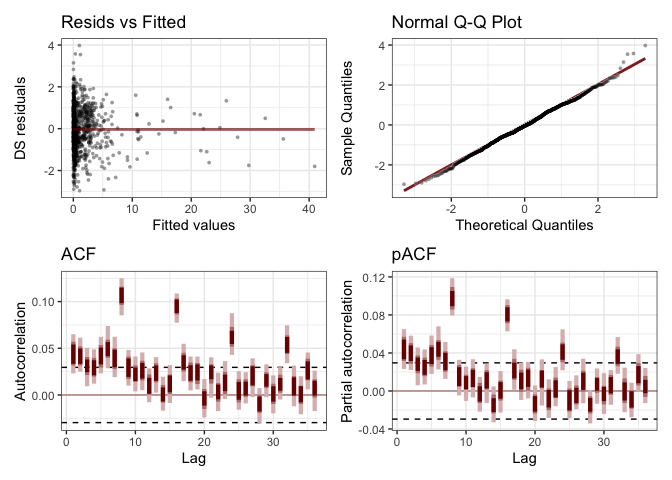

# mvgam baseline model
Simon Frost

## Libraries

``` r
library(mvgam)
```

    Loading 'mvgam' (version 1.1.593). Useful instructions can be found by
      typing help('mvgam'). A more detailed introduction to the package is
      available through vignette('mvgam_overview').

``` r
library(gratia)
```


    Attaching package: 'gratia'

    The following object is masked from 'package:mvgam':

        add_residuals

``` r
library(ggplot2)
```

``` r
set.seed(123)  # for reproducibility
```

## Helper functions

``` r
read_inla_to_mgcv <- function(file) {
  # Read all lines
  lines <- readLines(file)
  
  # First line is number of regions
  n <- as.integer(lines[1])
  
  # Initialize empty list
  nb_list <- vector("list", n)
  
  # Loop over each region
  for (i in 1:n) {
    parts <- strsplit(lines[i + 1], "\\s+")[[1]]
    parts <- parts[parts != ""]  # remove empties
    
    # Format: region_id, num_neighbors, neighbors...
    region_id <- as.integer(parts[1])
    #nbs <- as.integer(parts[-c(1, 2)])
    nbs <- parts[-c(1,2)]
    nb_list[[region_id]] <- nbs
  }
  
  nb_list
}
```

``` r
subset_nb <- function(nb_list, keep) {
  # ensure 'keep' is integer indices
  keep_int <- as.integer(keep)
  keep_char <- as.character(keep)
  # subset to regions in keep
  nb_sub <- nb_list[keep_int]
  
  # drop neighbors not in keep
  nb_sub <- lapply(nb_sub, function(nbs) nbs[nbs %in% keep_char])
  
  # keep original indices as names
  names(nb_sub) <- keep
  
  nb_sub
}
```

## Load data and process

``` r
df <- read.table("../data/lassa_states_endemic.tsv", header=TRUE, row.names=NULL)
# Exclude missing (forecast) datapoints
df <- df[!is.na(df$y),]
# Enforce factors
df$region <- as.factor(df$region)
df$region2 <- as.factor(df$region2)
df$polyid2 <- as.factor(df$polyid2)
# Load neighbour file
nb_loc <- "../data/states_nbmatrix"
nbr <- read_inla_to_mgcv(nb_loc)
nbr2 <- subset_nb(nbr, levels(df$polyid2))
```

``` r
vars <- c("y","logpop","polyid","polyid2","region", "region2","year","epiWeek","spi","precip")
df2 <- df[,vars]
df2$nbr2 <- rep(list(nbr2), nrow(df2))   # attach adjacency as a list-column
#df2_list <- as.list(df2)
#df2_list$nbr2 <- nbr2
#df2_list$nb <- nbr2
```

``` r
# Check unique values for variables used in P-spline smooths
cat("Unique values in variables used for P-spline smooths:\n")
```

    Unique values in variables used for P-spline smooths:

``` r
cat("year:", length(unique(df2$year)), "unique values\n")
```

    year: 9 unique values

``` r
cat("spi:", length(unique(df2$spi)), "unique values\n") 
```

    spi: 48 unique values

``` r
cat("precip:", length(unique(df2$precip)), "unique values\n")
```

    precip: 49 unique values

``` r
# For the year smooth with 'by' grouping, check per group
cat("\nFor year smooth by polyid2:\n")
```


    For year smooth by polyid2:

``` r
year_by_region <- tapply(df2$year, df2$polyid2, function(x) length(unique(x)))
print(year_by_region)
```

     5  7 11 12 23 29 32 35 
     9  9  9  9  9  9  9  9 

``` r
cat("Minimum unique years per region:", min(year_by_region), "\n")
```

    Minimum unique years per region: 9 

## Fit model

Define formula, using single `spi` and `precip` variables.

``` r
form <- formula(y ~ 1 +
                      offset(logpop) +
                      # Spatial effect – using a Markov random field smoother:
                      s(polyid2, bs = "mrf", xt = list(nb=nbr2)) +
                      # RW1 on year with one smooth per level of polyid2:
                      s(year, bs = "ps", k=9, m = 1, by = polyid2) +
                      # RW2 on epiWeek, cyclic, with one smooth per level of region2:
                      s(epiWeek, bs = "cc", m = 2, by = region2) +
                      # RW2 on spi:
                      s(spi, bs = "ps", k=12) +
                      # RW2 on precip:
                      s(precip, bs = "ps", k=12))
```

    Compiling Stan program using cmdstanr

    Start sampling

    Running MCMC with 4 parallel chains...

    Chain 1 Iteration:   1 / 1000 [  0%]  (Warmup) 
    Chain 2 Iteration:   1 / 1000 [  0%]  (Warmup) 
    Chain 3 Iteration:   1 / 1000 [  0%]  (Warmup) 
    Chain 4 Iteration:   1 / 1000 [  0%]  (Warmup) 
    Chain 4 Iteration: 100 / 1000 [ 10%]  (Warmup) 
    Chain 1 Iteration: 100 / 1000 [ 10%]  (Warmup) 
    Chain 2 Iteration: 100 / 1000 [ 10%]  (Warmup) 
    Chain 3 Iteration: 100 / 1000 [ 10%]  (Warmup) 
    Chain 4 Iteration: 200 / 1000 [ 20%]  (Warmup) 
    Chain 1 Iteration: 200 / 1000 [ 20%]  (Warmup) 
    Chain 2 Iteration: 200 / 1000 [ 20%]  (Warmup) 
    Chain 3 Iteration: 200 / 1000 [ 20%]  (Warmup) 
    Chain 4 Iteration: 300 / 1000 [ 30%]  (Warmup) 
    Chain 1 Iteration: 300 / 1000 [ 30%]  (Warmup) 
    Chain 3 Iteration: 300 / 1000 [ 30%]  (Warmup) 
    Chain 2 Iteration: 300 / 1000 [ 30%]  (Warmup) 
    Chain 1 Iteration: 400 / 1000 [ 40%]  (Warmup) 
    Chain 4 Iteration: 400 / 1000 [ 40%]  (Warmup) 
    Chain 3 Iteration: 400 / 1000 [ 40%]  (Warmup) 
    Chain 2 Iteration: 400 / 1000 [ 40%]  (Warmup) 
    Chain 1 Iteration: 500 / 1000 [ 50%]  (Warmup) 
    Chain 1 Iteration: 501 / 1000 [ 50%]  (Sampling) 
    Chain 4 Iteration: 500 / 1000 [ 50%]  (Warmup) 
    Chain 4 Iteration: 501 / 1000 [ 50%]  (Sampling) 
    Chain 3 Iteration: 500 / 1000 [ 50%]  (Warmup) 
    Chain 3 Iteration: 501 / 1000 [ 50%]  (Sampling) 
    Chain 2 Iteration: 500 / 1000 [ 50%]  (Warmup) 
    Chain 2 Iteration: 501 / 1000 [ 50%]  (Sampling) 
    Chain 1 Iteration: 600 / 1000 [ 60%]  (Sampling) 
    Chain 4 Iteration: 600 / 1000 [ 60%]  (Sampling) 
    Chain 3 Iteration: 600 / 1000 [ 60%]  (Sampling) 
    Chain 2 Iteration: 600 / 1000 [ 60%]  (Sampling) 
    Chain 4 Iteration: 700 / 1000 [ 70%]  (Sampling) 
    Chain 1 Iteration: 700 / 1000 [ 70%]  (Sampling) 
    Chain 3 Iteration: 700 / 1000 [ 70%]  (Sampling) 
    Chain 2 Iteration: 700 / 1000 [ 70%]  (Sampling) 
    Chain 4 Iteration: 800 / 1000 [ 80%]  (Sampling) 
    Chain 1 Iteration: 800 / 1000 [ 80%]  (Sampling) 
    Chain 3 Iteration: 800 / 1000 [ 80%]  (Sampling) 
    Chain 2 Iteration: 800 / 1000 [ 80%]  (Sampling) 
    Chain 4 Iteration: 900 / 1000 [ 90%]  (Sampling) 
    Chain 1 Iteration: 900 / 1000 [ 90%]  (Sampling) 
    Chain 3 Iteration: 900 / 1000 [ 90%]  (Sampling) 
    Chain 4 Iteration: 1000 / 1000 [100%]  (Sampling) 
    Chain 4 finished in 29.8 seconds.
    Chain 2 Iteration: 900 / 1000 [ 90%]  (Sampling) 
    Chain 1 Iteration: 1000 / 1000 [100%]  (Sampling) 
    Chain 1 finished in 30.7 seconds.
    Chain 3 Iteration: 1000 / 1000 [100%]  (Sampling) 
    Chain 3 finished in 31.3 seconds.
    Chain 2 Iteration: 1000 / 1000 [100%]  (Sampling) 
    Chain 2 finished in 32.5 seconds.

    All 4 chains finished successfully.
    Mean chain execution time: 31.0 seconds.
    Total execution time: 32.8 seconds.

## Model summary

``` r
summary(fit)
```

    GAM formula:
    y ~ 1 + offset(logpop) + s(polyid2, bs = "mrf", xt = list(nb = nbr2)) + 
        s(year, bs = "ps", k = 9, m = 1, by = polyid2) + s(epiWeek, 
        bs = "cc", m = 2, by = region2) + s(spi, bs = "ps", k = 12) + 
        s(precip, bs = "ps", k = 12)

    Family:
    negative binomial

    Link function:
    log

    Trend model:
    None

    N series:
    1 

    N timepoints:
    4390 

    Status:
    Fitted using Stan 
    4 chains, each with iter = 1000; warmup = 500; thin = 1 
    Total post-warmup draws = 2000

    Observation dispersion parameter estimates:
           2.5% 50% 97.5% Rhat n_eff
    phi[1]  2.1 2.4   2.7    1  3195

    GAM coefficient (beta) estimates:
                             2.5%     50%  97.5% Rhat n_eff
    (Intercept)           -4.9000 -4.8000 -4.700 1.00   624
    s(polyid2).1           1.8000  1.9000  2.000 1.00   953
    s(polyid2).2          -1.7000 -1.4000 -1.100 1.00  1631
    s(polyid2).3           1.7000  1.8000  1.900 1.00   964
    s(polyid2).4          -0.8100 -0.6200 -0.430 1.00  1577
    s(polyid2).5           0.0640  0.2500  0.420 1.00  1109
    s(polyid2).6          -0.3300 -0.1500  0.018 1.00   926
    s(polyid2).7          -2.9000 -2.3000 -2.000 1.00   418
    s(year):polyid25.1    -2.0000 -1.2000 -0.490 1.00  1902
    s(year):polyid25.2    -1.4000 -0.7400 -0.150 1.00  2582
    s(year):polyid25.3    -0.0140  0.5200  1.100 1.00  2136
    s(year):polyid25.4     0.3000  0.8700  1.500 1.00  1645
    s(year):polyid25.5    -0.3400  0.2700  0.900 1.00  1555
    s(year):polyid25.6     1.0000  1.5000  2.100 1.00  2221
    s(year):polyid25.7     1.5000  2.0000  2.500 1.00  2345
    s(year):polyid25.8     0.9200  1.6000  2.200 1.00  2923
    s(year):polyid27.1    -3.7000 -1.7000 -0.490 1.00  1098
    s(year):polyid27.2    -2.4000 -0.8400  0.580 1.00  1057
    s(year):polyid27.3    -0.2100  0.9400  2.900 1.01   373
    s(year):polyid27.4     0.3300  1.7000  3.900 1.01   334
    s(year):polyid27.5    -0.2300  1.1000  3.000 1.01   383
    s(year):polyid27.6     1.2000  2.3000  4.000 1.01   366
    s(year):polyid27.7     1.5000  2.6000  4.000 1.01   407
    s(year):polyid27.8     1.7000  2.7000  4.200 1.00   545
    s(year):polyid211.1   -2.4000 -1.3000 -0.510 1.00  1604
    s(year):polyid211.2   -0.0230  0.6600  1.500 1.00  1079
    s(year):polyid211.3    0.3400  0.9700  1.700 1.00  1161
    s(year):polyid211.4    0.9400  1.7000  2.600 1.00   913
    s(year):polyid211.5    0.2400  0.9500  1.800 1.00  1052
    s(year):polyid211.6    0.3100  0.9100  1.600 1.00  1341
    s(year):polyid211.7    0.2900  0.9000  1.700 1.00  1137
    s(year):polyid211.8   -0.5800  0.2200  1.000 1.00  2308
    s(year):polyid212.1   -2.9000 -2.0000 -1.200 1.00  1150
    s(year):polyid212.2    0.0200  0.4600  0.900 1.00  2414
    s(year):polyid212.3    0.5200  1.0000  1.500 1.00  1243
    s(year):polyid212.4    0.6100  1.2000  1.800 1.00   934
    s(year):polyid212.5    0.4300  0.9600  1.500 1.00  1201
    s(year):polyid212.6   -0.0330  0.5100  0.990 1.00  1204
    s(year):polyid212.7    0.1800  0.6600  1.100 1.00  1941
    s(year):polyid212.8   -0.6500 -0.0089  0.630 1.00  2230
    s(year):polyid223.1   -5.7000 -2.5000 -0.310 1.00  1280
    s(year):polyid223.2   -0.4300  0.9200  2.300 1.00  1371
    s(year):polyid223.3   -2.2000 -0.5200  1.000 1.00  1311
    s(year):polyid223.4    0.7100  2.3000  4.200 1.00   840
    s(year):polyid223.5   -4.3000 -2.0000 -0.033 1.00  1188
    s(year):polyid223.6    2.0000  3.3000  4.700 1.00   973
    s(year):polyid223.7   -2.8000 -1.3000  0.220 1.00  1342
    s(year):polyid223.8    2.7000  4.3000  6.000 1.00  1463
    s(year):polyid229.1   -1.8000 -1.2000 -0.550 1.00  1876
    s(year):polyid229.2   -0.2700  0.1800  0.620 1.00  2187
    s(year):polyid229.3    1.0000  1.5000  1.900 1.00  1407
    s(year):polyid229.4    1.2000  1.7000  2.200 1.00  1083
    s(year):polyid229.5    0.8000  1.3000  1.800 1.00  1338
    s(year):polyid229.6    1.1000  1.5000  1.900 1.00  1559
    s(year):polyid229.7    0.9400  1.3000  1.800 1.00  1971
    s(year):polyid229.8    0.4000  0.9400  1.600 1.00  2441
    s(year):polyid232.1   -0.8600 -0.2100  0.280 1.00  1903
    s(year):polyid232.2   -0.3600  0.1700  0.650 1.00  2198
    s(year):polyid232.3    0.1600  0.6000  1.100 1.00  2152
    s(year):polyid232.4    0.0660  0.5600  1.100 1.00  1754
    s(year):polyid232.5   -0.8100 -0.1900  0.340 1.00  1884
    s(year):polyid232.6   -0.7200 -0.1700  0.410 1.00  3036
    s(year):polyid232.7   -0.6000 -0.0640  0.520 1.00  3288
    s(year):polyid232.8   -1.0000 -0.2200  0.490 1.00  3144
    s(year):polyid235.1   -0.6700  0.1200  1.500 1.00   713
    s(year):polyid235.2   -0.0590  0.6600  1.600 1.00   810
    s(year):polyid235.3    0.0850  0.7400  1.700 1.00   747
    s(year):polyid235.4    0.5700  1.5000  2.900 1.00   545
    s(year):polyid235.5   -0.2200  0.5300  1.800 1.00   651
    s(year):polyid235.6    0.2600  0.8800  1.700 1.00   783
    s(year):polyid235.7    1.2000  1.9000  3.100 1.00   663
    s(year):polyid235.8    0.0064  0.8100  1.500 1.00  2522
    s(epiWeek):region21.1  1.5000  1.6000  1.800 1.00  1008
    s(epiWeek):region21.2  0.2700  0.4400  0.640 1.00  1000
    s(epiWeek):region21.3 -0.7600 -0.5800 -0.410 1.00  4105
    s(epiWeek):region21.4 -0.8000 -0.5000 -0.210 1.00   567
    s(epiWeek):region21.5 -0.7100 -0.3500 -0.041 1.00   545
    s(epiWeek):region21.6 -1.0000 -0.8100 -0.560 1.00  1065
    s(epiWeek):region21.7 -1.1000 -0.9000 -0.700 1.00  3539
    s(epiWeek):region21.8 -0.9800 -0.8100 -0.620 1.00  1736
    s(epiWeek):region22.1  1.5000  1.7000  2.000 1.00   906
    s(epiWeek):region22.2  0.2300  0.4400  0.670 1.00  1049
    s(epiWeek):region22.3 -1.2000 -0.9000 -0.610 1.00  2376
    s(epiWeek):region22.4 -1.6000 -1.2000 -0.800 1.00   893
    s(epiWeek):region22.5 -1.5000 -1.1000 -0.670 1.00   986
    s(epiWeek):region22.6 -1.7000 -1.3000 -0.900 1.00  1303
    s(epiWeek):region22.7 -1.6000 -1.2000 -0.920 1.00  2390
    s(epiWeek):region22.8 -0.6900 -0.4400 -0.190 1.00  2857
    s(spi).1              -0.7700  0.0075  0.630 1.00  1010
    s(spi).2              -1.4000 -0.6500  0.035 1.00  1373
    s(spi).3              -1.6000 -0.9900 -0.490 1.00  1364
    s(spi).4              -1.0000 -0.6800 -0.270 1.00   846
    s(spi).5              -0.9900 -0.3600  0.310 1.00   575
    s(spi).6              -1.0000 -0.2500  0.600 1.00   604
    s(spi).7              -0.8600 -0.1900  0.550 1.00   584
    s(spi).8              -0.8600 -0.3700  0.180 1.00   605
    s(spi).9              -0.6900 -0.3100  0.094 1.00   817
    s(spi).10             -0.4600 -0.1000  0.260 1.00  3066
    s(spi).11             -1.5000 -0.1800  1.100 1.00  1298
    s(precip).1           -0.4000  0.1000  0.700 1.00  1001
    s(precip).2           -0.2000  0.2300  0.730 1.00   959
    s(precip).3           -0.0340  0.2900  0.640 1.00  1033
    s(precip).4            0.2100  0.5600  0.940 1.00   672
    s(precip).5           -0.0530  0.3300  0.720 1.01   651
    s(precip).6           -0.0580  0.3500  0.770 1.00   527
    s(precip).7           -0.1500  0.2300  0.570 1.01   452
    s(precip).8           -0.0300  0.3200  0.640 1.01   511
    s(precip).9           -0.4300 -0.0390  0.340 1.00   733
    s(precip).10          -0.7500 -0.3400  0.028 1.00  1926
    s(precip).11          -1.3000 -0.4000  0.550 1.00   796

    Approximate significance of GAM smooths:
                          edf Ref.df Chi.sq  p-value    
    s(polyid2)          6.986      7 6699.6  < 2e-16 ***
    s(year):polyid25    6.238      8  491.6  < 2e-16 ***
    s(year):polyid27    7.459      8 1060.4 0.001285 ** 
    s(year):polyid211   5.340      8  329.8 2.78e-06 ***
    s(year):polyid212   6.927      8  328.6  < 2e-16 ***
    s(year):polyid223   7.913      8  641.6 1.09e-05 ***
    s(year):polyid229   7.298      8  433.9  < 2e-16 ***
    s(year):polyid232   5.459      8   42.6 0.051261 .  
    s(year):polyid235   6.566      8  222.3 0.000176 ***
    s(epiWeek):region21 7.507      8  857.7  < 2e-16 ***
    s(epiWeek):region22 7.742      8  607.2  < 2e-16 ***
    s(spi)              5.645     11  131.5  < 2e-16 ***
    s(precip)           5.985     11   39.6 0.062574 .  
    ---
    Signif. codes:  0 '***' 0.001 '**' 0.01 '*' 0.05 '.' 0.1 ' ' 1

    Stan MCMC diagnostics:
    ✔ No issues with effective samples per iteration
    ✔ Rhat looks good for all parameters
    ✔ No issues with divergences
    ✔ No issues with maximum tree depth

    Samples were drawn using sampling(hmc). For each parameter, n_eff is a
      crude measure of effective sample size, and Rhat is the potential scale
      reduction factor on split MCMC chains (at convergence, Rhat = 1)

    Use how_to_cite() to get started describing this model

## Model diagnostics

``` r
plot(fit)
```


